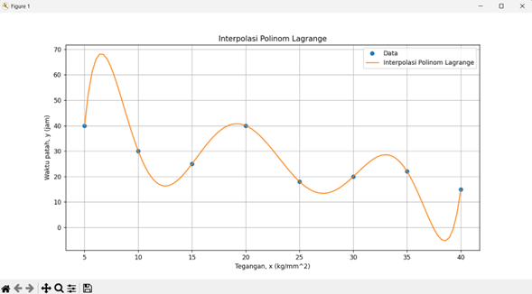
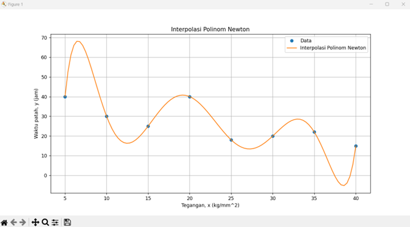

# Tugas Implementasi Interpolasi
## Deskripsi
Merupakan implementasi kode untuk permasalahan Interpolasi yang dibuat dengan bahasa Python. Berisikan 2 metode penyelesaian yaitu:
- metode Lagrange
- metode Newton  

|   |   |
|---|---|
|Nama | Naufal Izzuddin Taufik |
|NIM | 21120122140102 |
|Kelas | Metode Numerik B| 
 

## Hasil
- Metode Lagrange  

- Metode Newton

